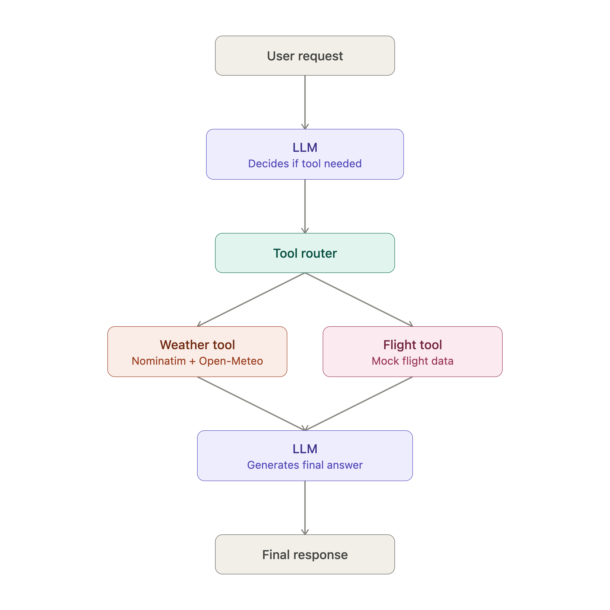

# LLM Tool Calling Agent

A Python-based LLM agent that dynamically selects and executes tools using function calling.



## Table of contents

- [Overview](#overview)
- [Architecture](#architecture)
- [Tech stack](#tech-stack)
- [Tools](#tools)
- [Agent loop](#agent-loop)
- [Example](#example)
- [Project structure](#project-structure)
- [Running the project](#running-the-project)
- [What I learned](#what-i-learned)
- [Future improvements](#future-improvements)

## Overview

This project demonstrates how an LLM can interact with external tools instead of generating responses using only its internal knowledge.

The agent can:

- Understand a user's request
- Decide which tool is required
- Generate structured tool calls
- Execute the selected tool
- Return tool results to the LLM
- Generate a final response based on the tool results
- Execute multiple tools for a single request

## Architecture

```text
User
  ↓
LLM (decides if a tool is needed)
  ↓
Tool Router
  ↓          ↓
Weather    Flight
  Tool       Tool
  ↓          ↓
API Data   Flight Data
  └────┬─────┘
       ↓
      LLM (generates final answer)
       ↓
 Final Response
```

## Tech stack

| Category | Tools |
|---|---|
| Language | Python |
| LLM access | OpenRouter, LLM APIs |
| Core technique | Function calling / tool calling |
| Networking | REST APIs, `requests`, JSON |
| Config | Environment variables |
| Version control | Git & GitHub |

## Tools

### Weather tool

Retrieves weather information for a requested location.

- **Nominatim** for geocoding
- **Open-Meteo** for weather data

### Flight search tool

Demonstrates how an agent can route requests to different tools.

> Note: the current flight tool uses mock data for learning and agent orchestration purposes.

## Agent loop

```text
1. User sends a request
2. LLM analyzes the request
3. LLM decides whether a tool is required
4. LLM generates tool call(s)
5. Agent executes the tool(s)
6. Tool results are returned to the LLM
7. LLM generates the final answer
```

The agent supports multiple tool calls in the same request.

## Example

A user could ask:

```text
What's the weather in Hyderabad and find me a flight to Delhi?
```

The LLM determines that two tools are required:

```text
Weather Tool → Hyderabad weather
Flight Tool  → Flight search
```

The agent executes both tools and sends their results back to the LLM before producing the final response.

## Project structure

```text
llm-tool-calling-agent/
├── agent.py                     # Core agent loop and tool router
├── llm-tool-calling-agent.py    # Entry point
├── requirements.txt             # Dependencies
├── screenshots/                 # Architecture diagram and run screenshots
├── .gitignore
└── README.md
```

## Running the project

### 1. Clone the repository

```bash
git clone https://github.com/shanmukh-pallapu7/llm-tool-calling-agent.git
cd llm-tool-calling-agent
```

### 2. Create a virtual environment

```bash
python3 -m venv .venv
source .venv/bin/activate
```

### 3. Install dependencies

```bash
pip install -r requirements.txt
```

### 4. Configure your API key

Create a `.env` file or export the required environment variable:

```bash
export API_KEY="your_api_key"
```

Do not commit API keys or other secrets to GitHub.

### 5. Run the agent

```bash
python3 llm-tool-calling-agent.py
```

## What I learned

- How LLM tool calling works
- Tool schemas and structured arguments
- Dynamic tool routing
- JSON argument parsing
- Multi-tool execution
- Agent loops
- Tool results and message sequencing
- Error handling during tool execution
- Calling external APIs from an AI agent
- Connecting LLMs with real-world services
- Using Git and GitHub to version-control an AI project

## Future improvements

- Replace mock flight data with a real flight API
- Add more tools
- Add conversation memory
- Improve error handling and retries
- Add logging
- Add automated tests
- Add streaming responses
- Add evaluation of tool selection
- Containerize the application
- Deploy the agent as an API service

---

**Learning project — AI engineer journey**
